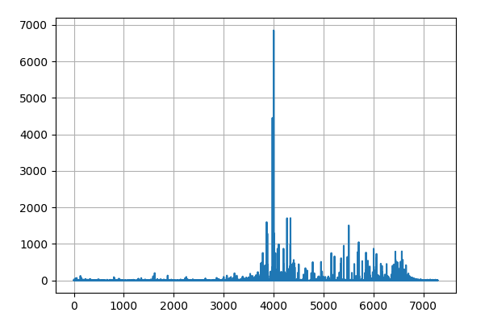
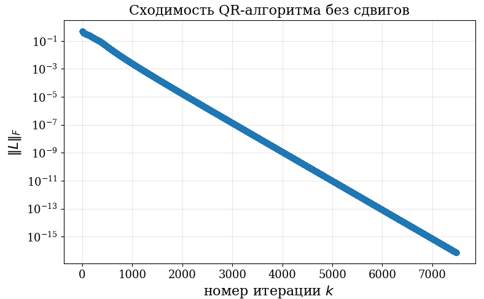
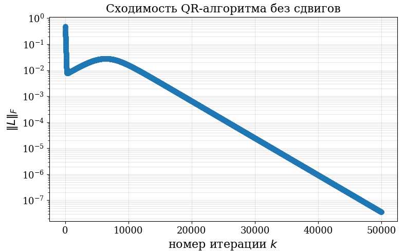
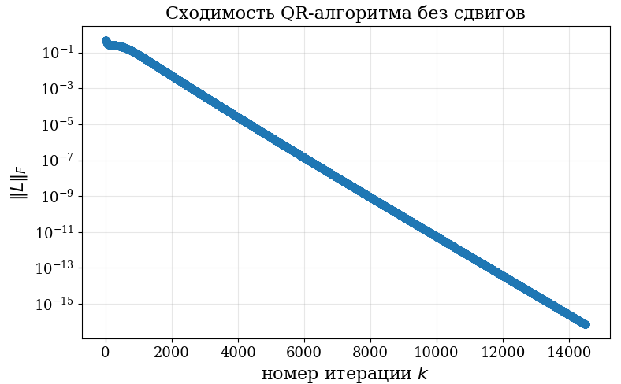
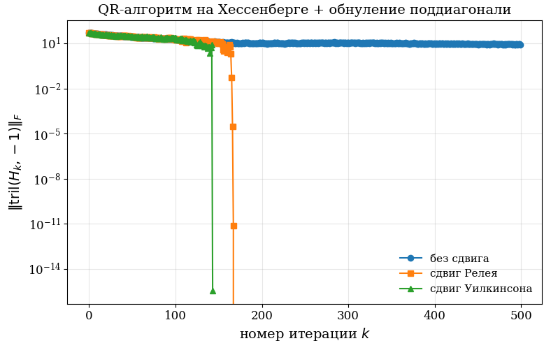

# Заметки по различным темам вычислительной линейнгой алгебры 

Источники: пары МГУ ВМК ВТМ, ALAFF (youtube), пары Оселедца по вычлиналу на Физтехе, мой опыт взаимодействия с численным анализом различных задач.

Здесь будут наибоеле интересные для меня факты, без какой-то базы. Сначала бдет в некотом смысле классическая часть вычлинала, а потом более современная.

# Классическая часть

## 0. Обрашение матрицы через inverse -- это плохо? 

Скорее всего это связано с решениями систем линейных уравнений, а не с честным нахождением обратной матрицы.

1. Найти обратную матрицу -- это $O(N^3)$, таким образов это во-первых дорого и долго
2. Если число обусловленности матрицы достаточно большое, то обращение любым доступнм способом будет довольно плохо работать. При этом это не является численной особенностью самого алгоритма, это буквально устойчивость задачи на непрерывном уровне: относительная ошибка в обратной матрице ограничивается числом обусловленности * относительную ошибку в матрице. Поэтому любой алгоритм для обращения будет давать плохой результат (пример в inverse_is_bad/different_inverce.py)

При этом для систем небольшого размера (скажем, сотни и тысячи) с небольшим числом обусловленности -- прямое обращение Гауссом -- нормально работает и не даёт большой ошибки.

## 1. Унитарные матрицы и почему мы их любим

Это очень хорошие матрицы и мы всегда хотим, чтобы они появлялись в различных алгоритмах. Почему?

#### Свойства унитарных матриц
* Унитарные матрицы имеют спектральное число обусловленности равным единице
* Унитарные матрицы нормальные $\rightarrow$ имеют диагональную форму Шура, все их собственные числа лежат на окружности единичного радиуса
* Все сингулярные числа унитарных матриц равны единице
* Унитарные матрицы важны для унитарно инвариантных норм, так как они их не изменяют. Это важный класс норм
* Унитарно инвариантная норма унитарной матрицы равна единице. 
* Унитарные матрицы и только они переходят ортогональный базис в ортогональный
* Согласно первому свойству и тероии устойчивости имеем, что ошибка в решении системы с унитарной матрицей не увеличивает ошибку в правой части. Аналогично в умножении матрицы на вектор (так как это просто умножение на обратную матрицу да и все), соотвественно умножение на унитарную матрицу не будет увеличивать накопленную ошибку в правой части. Соотвественно, если алгоритм абьюзит умножение на унитарные матрицы, то он не увеличивает, которая была в исходной правой части. 

**Замечание**: почти все алгоритмы (кроме LU разложения) так или иначе используют QR разложение в своей форме (одна из причин: так как нужно формировать унитарные матрицы в мтаричных разложениях), а значит, если всегда пользоваться унитарными матрицами, то все будет хорошо в смысле устойчивости к прогрешностям округления (они не будут расти от шага к шагу).

## 2. Обусловленность задачи МНК

Обусловленность задачи МНК може быть существенно хуже обусловленнсти задачи о решении СЛАУ. Все из-за того, что решение МНК связано с решением СЛАУ для проекции правой части на образ (пространство столбцов) матрицы А:

$ Ax = b \sim Ax = Qb,$ где $Q$ --- ортопроектор на $ImA$. Такая система совместна $\rightarrow$ имеем оценку

$\frac{\|\delta x\|}{\|x\|} \leq cond(A) \frac{\|\delta (Qb)\|}{\|Qb\|} * \frac{\|b\|}{\|\delta b\|}* \frac{\|\delta b\|}{\|b\|} \leq \frac{cond(A)}{\cos\theta}\frac{\|\delta b\|}{\|b\|}$

Таким образом ещё важно понимать насколько далеко лежит вектор правой части от пространства $Im A$. 

С другой стороны эта оценка немного тавтологична, поскольку чем меньше угол между $b$ и $Im A$, тем меньше получается по норме самое решение задачи МНК, так что ясное дело, что ошибка (относительная будет большая). Но формально задача может быть сильно обусловлена. 

## 3. Согласование правой части и линейной системы

Эффект, который я поймал на своей задаче с излучением воновода. Правая часть довольно плохо согласована с линейной системой, которую нужно решать:

В этом случае GMRES будет довольно долго сходиться с такой правой частью. Возможно, поможет какая-то перестановка, но тут я без понятия, честно говоря.

## 4. Численная устойчивость и обусловленность

***Опр:*** Обусловленность --- это характеристика задачи, которая показывает насколько поставленная задача $x \rightarrow f(x)$ чувствительна к измененим в начальных данных. 

Фактически, обусловленность --- это некоторая характеристика устойчивости самой аналитической задачи, она не имеет отношения к *алгоритму, с помощью которого задача решается*.  В любом случае, плохо обсусловленную задачу на компьютере с высокой точностью решить не получится (пример линейной системы с матрицей Гильберта).

***Опр:*** Численная устойчивость --- это харакретистика алгоритма, то есть нашей *реализации расчета* $x \rightarrow f(x)$. 

Таким образом, мы всегда хотим применить численно устойчивый алгоритм к хорошо обусловленным задачам. Любые другие комбинации слов приводят к проблемам.

### Прямой и обратный метод для анализа ошибок

Тут конечно надо дописать это дело

## 5. QR алгоритм

В простейшем случае QR алгоритм совпадает с обычным методом итерации подпространства, он может очень медленно сходится при наличии близких собственных значений. При этом ещё и каждая его итерация будет стоить куб, что в итоге даст четвертую степень. Но идея именно в переписывании метода итераций подпространства в таком виде, что он будет более учтойчивый и простой с точки зрения дефолтных подпрограмм (там используется только куар в виде хаусхолдера и гивенса). Все остальное -- сдвиги, приведение к бидиагональной форме и т.д и т.п. -- это навороты, которые позволяют из кринжевого алгоритма сделать суперустойчивый алгортим за куб. 

Попробую привести примеры на сходимость простейшего куар алгоритма: 

* Эрмитова матрица 50х50: 133 итерации на одно собственное значение в среднем.

* Эрмитова матрица 40х40: почему-то резко стало сильно хуже.

* Неэрмитова матрица 40х40: больше 200 итераций на с.з.

### QR со сдвигами

Для сдвигов есть несколько тактик. Основные из них -- сдвиг Релея (по соотноешнию Релея) и сдвиг Уилкинсона (по приближению собственного числа). Первый работает и для неприведённой к верхне хессендерговой форме матрице, второй --- сделан специально для неё.

Пример сравнения сходимость QR со сдвигом и без сдвигов: матрица 50х50, случайная комплексная

Cходимость офигеть как улучшилась, получилось реально 2 итерации на собственное значение. Говорят, что есть теория, по которой со сдвигом Уилкинсона сходимость для каждого собственного значения получается кубическая. При этом фробениусова норма вектора ошибки на собственном зачении есть порядка $10^{-8}$, что не очень хорошо: многовато. Это происходит из-за того, что без применения дефляций приходится руками занулять сошедшуюся поддиагональ, но в процессе вычислений там все равно появляются ненули => мы вносим какую-то ошибку в собственные значения. Если дефляцию делать, то аналогичная норма ошибки будет уже $10^{-13}$, что на 5 порядков лушче. Победа.

Опытным путём установлено, что для работы сдвигов критичеки важно приведение матрицы к верхней хессенберговой форме.

### Неявно сдвинутый QR

И на вершине всего этого дела есть неявно сдвинутый QR, который не вычисляет матрицу $A - \mu I$, чтобы не получить случайно catastriphic cancellation в диагональном элементе. Он основан на так называемой implicit Q theorem. Она говорит о том, что есть есть соотноешние вида $A Q = Q B$, где $A$ и $B$ верхне хессенберговы, а $Q$ -- унитарная, то матрица $Q$ определяется своим первым столбцом. Это позволяет применять не исходную последовательность вращений Гивенса для QR разложения, а некоторую другую, для которой не нужно считать сдвиги, причем применяется она не к сдвинутой матрице, а к исходной. И получается достаточно практичный алгоритм за куб, притом устойсчивый, так как все операции сделаны через унитарные матрицы. 

Итерация на основое Implicit Q Theorem назвается Fransis QR Iteration. Алгоритм называется Implicitly Shifted QR Algorithm, относительно предыдущих он ещё более устойчивый и  стоит где-то на 25% меньше. 

### Теория сходиости QR алгоритма

Подробно она опписана у ЕЕ, но я хочу понять суть, а не доказательсва теорем. Здесь постараюсь описать, что происходит на уровне идей.

# Современная часть

## $H^2$ матрицы

Идея в малоранговой аппроквации заключается в том, что для аналитических функций можно сделать быстросходящийся ряд тейлора, при этом если матрица есть просто